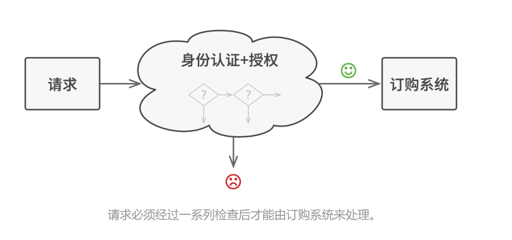
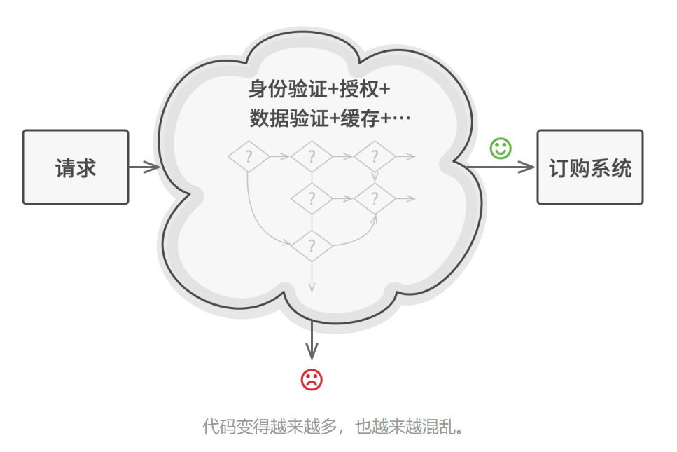
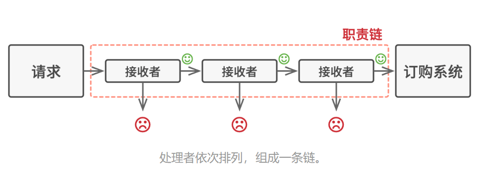
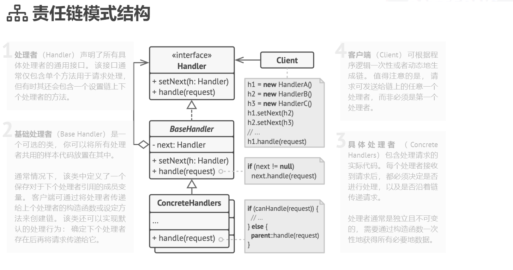

# 问题
假如你正在开发一个在线订购系统。 你希望对系统访问进行限制， 只允许认证用户创建订单。 此外， 拥有管理权限的用户也拥有所有订单的完全访问权限。

简单规划后， 你会意识到这些检查必须依次进行。 只要接收到包含用户凭据的请求， 应用程序就可尝试对进入系统的用户进行认证。 但如果由于用户凭据不正确而导致认证失败， 那就没有必要进行后续检查了。

责任链解决的问题
请求必须经过一系列检查后才能由订购系统来处理。
在接下来的几个月里， 你实现了后续的几个检查步骤。

一位同事认为直接将原始数据传递给订购系统存在安全隐患。 因此你新增了额外的验证步骤来清理请求中的数据。

过了一段时间， 有人注意到系统无法抵御暴力密码破解方式的攻击。 为了防范这种情况， 你立刻添加了一个检查步骤来过滤来自同一 IP 地址的重复错误请求。

又有人提议你可以对包含同样数据的重复请求返回缓存中的结果， 从而提高系统响应速度。 因此， 你新增了一个检查步骤， 确保只有没有满足条件的缓存结果时请求才能通过并被发送给系统。

每增加一个检查步骤，程序都变得更加臃肿、混乱和丑陋

检查代码本来就已经混乱不堪， 而每次新增功能都会使其更加臃肿。 修改某个检查步骤有时会影响其他的检查步骤。 最糟糕的是， 当你希望复用这些检查步骤来保护其他系统组件时， 你只能复制部分代码， 因为这些组件只需部分而非全部的检查步骤。

系统会变得让人非常费解， 而且其维护成本也会激增。 你在艰难地和这些代码共处一段时间后， 有一天终于决定对整个系统进行重构。

# 解决方案
与许多其他行为设计模式一样， 责任链会将特定行为转换为被称作处理者的独立对象。 在上述示例中， 每个检查步骤都可被抽取为仅有单个方法的类， 并执行检查操作。 请求及其数据则会被作为参数传递给该方法。

模式建议你将这些处理者连成一条链。 链上的每个处理者都有一个成员变量来保存对于下一处理者的引用。 除了处理请求外， 处理者还负责沿着链传递请求。 请求会在链上移动， 直至所有处理者都有机会对其进行处理。

最重要的是： 处理者可以决定不再沿着链传递请求， 这可高效地取消所有后续处理步骤。

在我们的订购系统示例中， 处理者会在进行请求处理工作后决定是否继续沿着链传递请求。 如果请求中包含正确的数据， 所有处理者都将执行自己的主要行为， 无论该行为是身份验证还是数据缓存。

不过还有一种稍微不同的方式 （也是更经典一种）， 那就是处理者接收到请求后自行决定是否能够对其进行处理。 如果自己能够处理， 处理者就不再继续传递请求。 因此在这种情况下， 每个请求要么最多有一个处理者对其进行处理， 要么没有任何处理者对其进行处理。 在处理图形用户界面元素栈中的事件时， 这种方式非常常见。

# 责任链模式适合应用场景
当程序需要使用不同方式处理不同种类请求， 而且请求类型和顺序预先未知时， 可以使用责任链模式。

该模式能将多个处理者连接成一条链。 接收到请求后， 它会 “询问” 每个处理者是否能够对其进行处理。 这样所有处理者都有机会来处理请求。

当必须按顺序执行多个处理者时， 可以使用该模式。

无论你以何种顺序将处理者连接成一条链， 所有请求都会严格按照顺序通过链上的处理者。

如果所需处理者及其顺序必须在运行时进行改变， 可以使用责任链模式。

如果在处理者类中有对引用成员变量的设定方法， 你将能动态地插入和移除处理者， 或者改变其顺序。

# 实现方式
声明处理者接口并描述请求处理方法的签名。

确定客户端如何将请求数据传递给方法。 最灵活的方式是将请求转换为对象， 然后将其以参数的形式传递给处理函数。

为了在具体处理者中消除重复的样本代码， 你可以根据处理者接口创建抽象处理者基类。

该类需要有一个成员变量来存储指向链上下个处理者的引用。 你可以将其设置为不可变类。 但如果你打算在运行时对链进行改变， 则需要定义一个设定方法来修改引用成员变量的值。

为了使用方便， 你还可以实现处理方法的默认行为。 如果还有剩余对象， 该方法会将请求传递给下个对象。 具体处理者还能够通过调用父对象的方法来使用这一行为。

依次创建具体处理者子类并实现其处理方法。 每个处理者在接收到请求后都必须做出两个决定：

* 是否自行处理这个请求。
* 是否将该请求沿着链进行传递。
客户端可以自行组装链， 或者从其他对象处获得预先组装好的链。 在后一种情况下， 你必须实现工厂类以根据配置或环境设置来创建链。

客户端可以触发链中的任意处理者， 而不仅仅是第一个。 请求将通过链进行传递， 直至某个处理者拒绝继续传递， 或者请求到达链尾。

由于链的动态性， 客户端需要准备好处理以下情况：

* 链中可能只有单个链接。
* 部分请求可能无法到达链尾。
* 其他请求可能直到链尾都未被处理。

# 责任链模式优缺点
* 你可以控制请求处理的顺序。
* 单一职责原则。 你可对发起操作和执行操作的类进行解耦。
* 开闭原则。 你可以在不更改现有代码的情况下在程序中新增处理者。
* 缺点:部分请求可能未被处理