# 设计一个worker
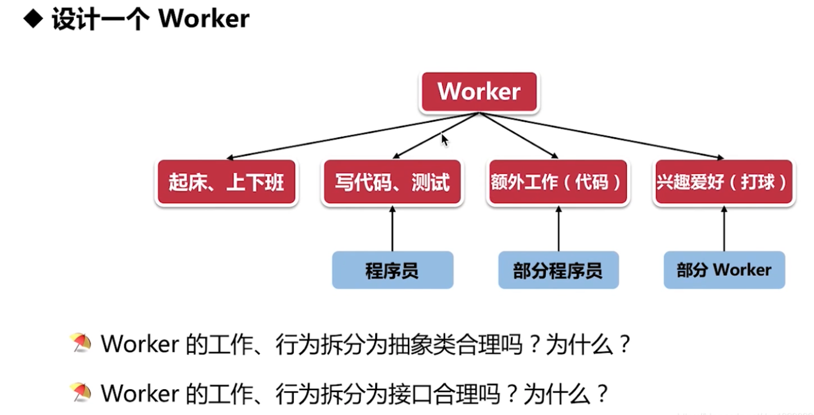

共同有状态的属性 用 抽象类：起床、上下班。
特有的独立的属性用 接口：程序员，部分程序员。

# 编程中怎么选择抽象类和接口
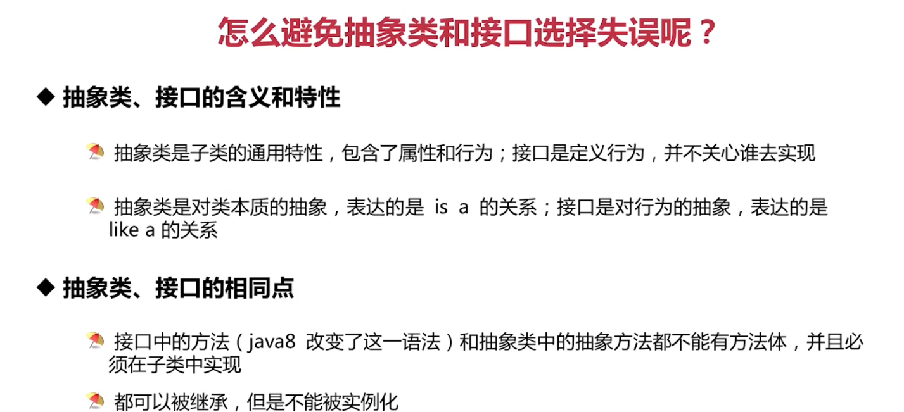

# 怎么避免抽象类和接口选择失误
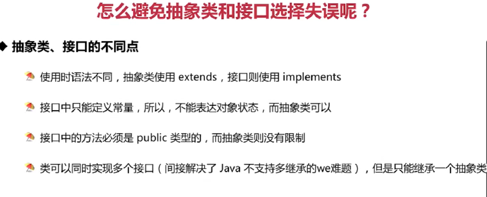

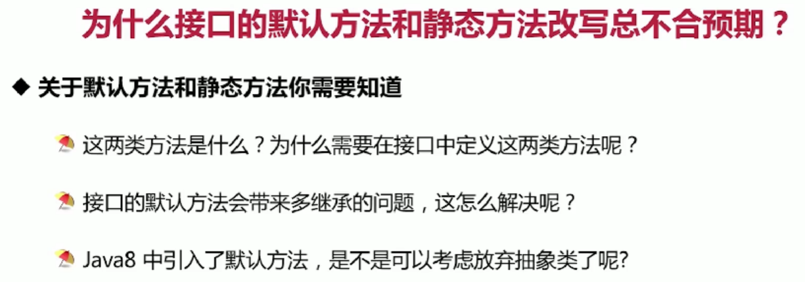
默认方法是为了配合jdk函数是接口实现的更有拓展性，默认继承。
接口的默认方法多继承问题，子类实现改方法就行。

相关代码见包文件: com.shooterj.java.escape.abstract_interface

# 实现了 Serializable 接口却报错怎么办?
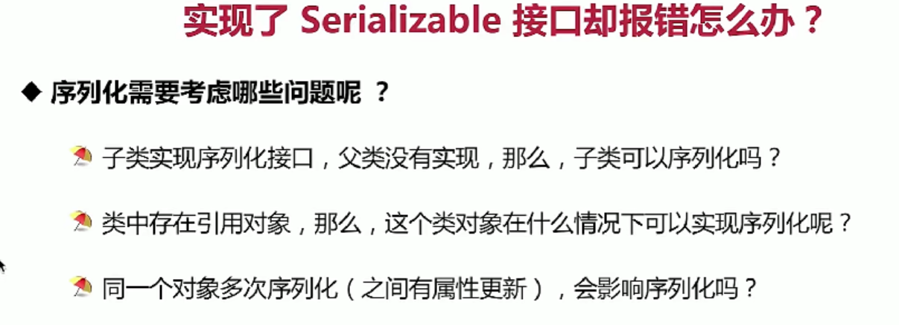

1.父类只要提供默认空参构造方法就行，如果父类没有提供无参构造函数则报错。
2.引用对象和自身都需要实现序列化才行。
3.java序列化算法，不会重读多次序列化。
相关代码见包文件：com.shooterj.java.escape.serialization

# 反射
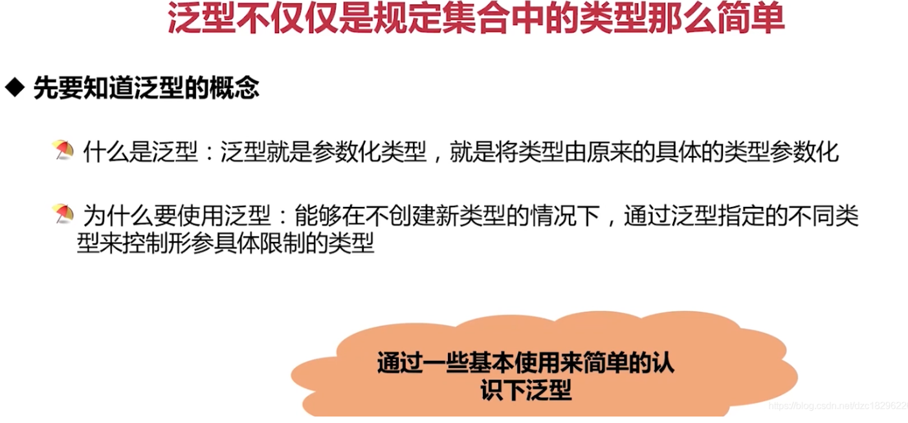
类型擦除
java的泛型是伪泛型
在字节码会被擦除

* 1.先检查后编译
* 2.泛型不支持继承
* 3.泛型类型变量不能是基本数据类型
* 4.泛型的类型参数只能是类类型, 不能是简单类型
* 5.不要用原始类型

反射缺陷：
* 1.性能开销
* 2.破坏封装性
* 3.内部曝光

反射本质：在运行时将JAVA类的各个成分映射成一个个JAVA对象。

类加载过程：
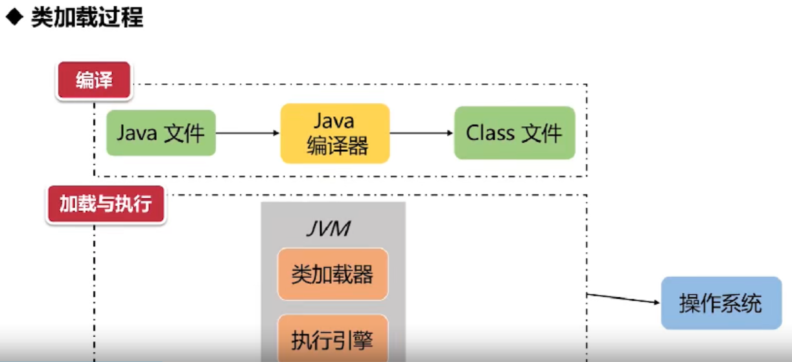
JAVA编译器将java文件编译成class字节码文件保存在到磁盘中，
JVM类加载器读取CLASS文件，取出二进制数据加载到内存中，然后解析CLASS文件的信息，
类加载器会根据类的全限定名称获取这个类的二进制字节流，根据字节流代表的静态存储结构
转化为方法区的运行时数据结构，最后在内存中生成代表这个类的class对象。
加载结束后，JVM进行连接阶段，经过一些列操作，类的变量就会被初始化，代码中就可以使用到类的各种属性。

反射中的坑：
* 方法的参数是基本类型，反射获取 Method 参数类型必须一致
* 调用的方法属于对象的父类, getDeclaredMethod 会抛出异常

# 字符串拼接
"12"+"21" 编译器会生成StringBuilder对象，影响性能

StringBuilder和StringBuffer区别
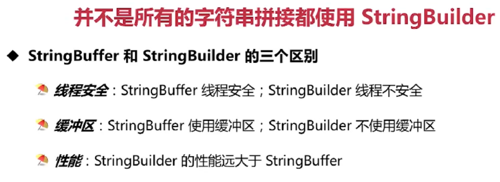

# 深浅拷贝
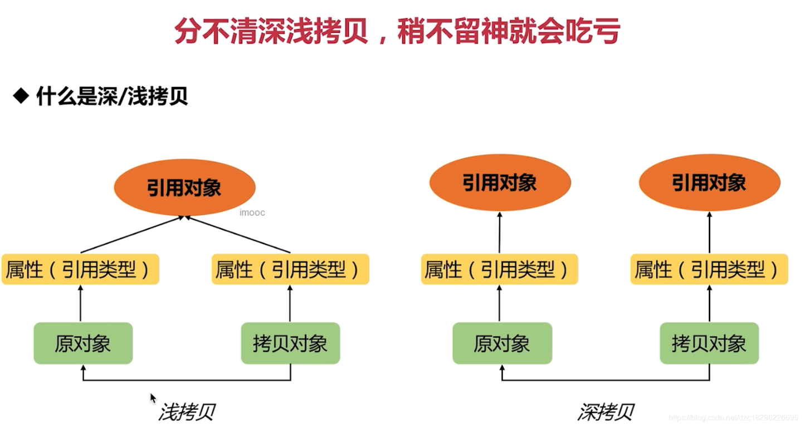
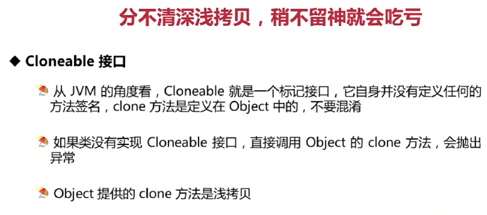
对引用对象是否发生了新地址的拷贝
浅拷贝会改变原始引用对象，深拷贝就好比new了一个新对象，不会影响原始对象。

坑点：
* 1。类没有实现 Cloneable 接口直接调用clone()会报错 ，object提供的方法即是浅拷贝
  
实现深拷贝的方法：
* 简单的new后返回
* 使用native的clone改进
* 使用流创建

# synchronize关键字

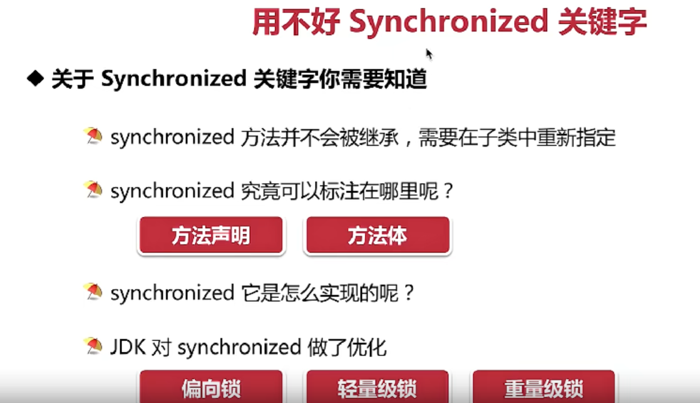

1.synchronize 关键字不能被继承
2.synchronize 修饰静态方法等于给类对象加锁，非静态对象相当于当前方法加锁
3.通过编译后的字节码得出 synchronize是通过获取monitorenter和monitorexit 加锁和解锁来解决并发竞争
4.synchronize锁升级：
偏向锁（一个线程，无锁）
-> 轻量级锁（不会阻塞会自旋，若干个自旋太多则挂起）
-> 重量级锁（如果很多线程进入临界区去请求锁，线程将进入阻塞状态，
因为线程从运行状态切换到阻塞状态进行上下文切换，线程之间大量切换，会耗费大量资源和时间）

# Automic类多线程下修改共享变量：

悲观锁：
互斥同步，同一时刻有且只有一个线程去操作共享数据，其他线程必须等待该线程处理结束之后才能进行（synchronize）
悲观锁缺点：
从阻塞状态转换为唤醒状态从而带来的性能问题。

乐观锁：
CAS操作：比较内存值，自旋然后，直到与内存值保持一致再更新
CAS的ABA问题
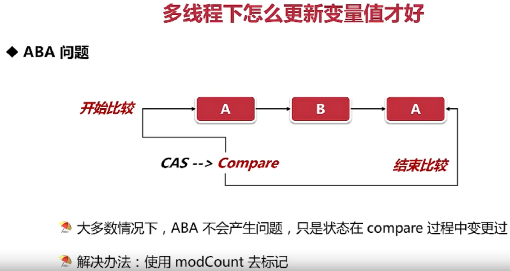

# ArrayBlockingQueue
1.有界阻塞队列一旦创建，就不能再变化
2.put和take分别会在阻塞队列空了或者满了进行阻塞
3.offer和poll不会进行阻塞，队列空了，消费会抛出异常

# CopyOnWrite思想(写时复制，读写分离)
1.当线程对集合添加元素时，不会直接往当前容器中添加，而会copy一份新容器进行修改，
修改完成后，将原容器的引用指向新的容器，可以进行并发读写，不会存在线程安全问题。
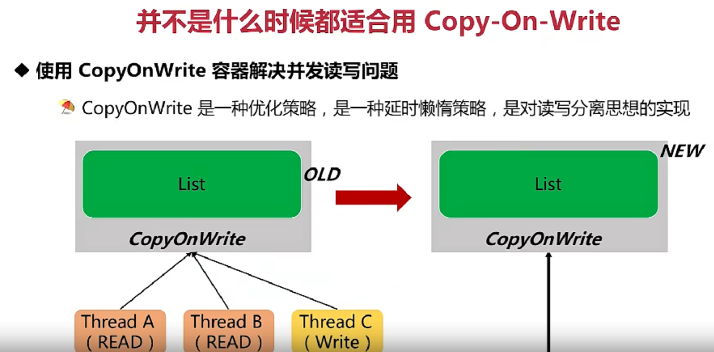

优缺点：

开发注意：减少扩容开销，批量添加元素。

CopyOnWrite对比Collections.synchronizedList：
写：CopyOnWrite内部加锁，并且进行了copy，性能较差。
读：CopyOnWrite不加锁，性能佳。

# 线程池
Executors.newFixedThreadPool(threadCount);
使用无界线程池，会导致任务越来越多,线程池的线程不够用的时候，任务会不断加到阻塞队列，会频繁GC，甚至OOM
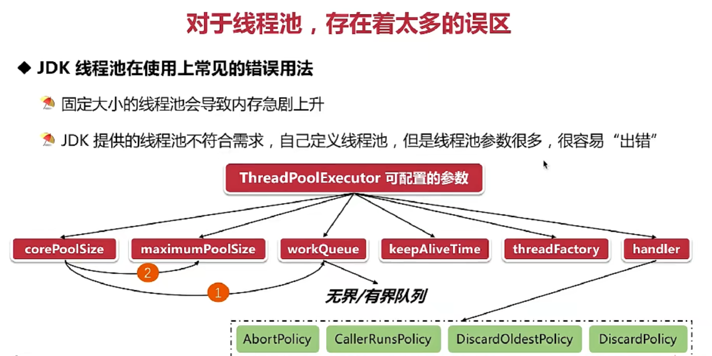

解决方案：自定义线程池，自定义拒绝策略，
threadExecute.getQueue().put(Runnbale) ，
当队列满后，线程阻塞，当队列释放，加入队列。进行任务调度。

线程池监控
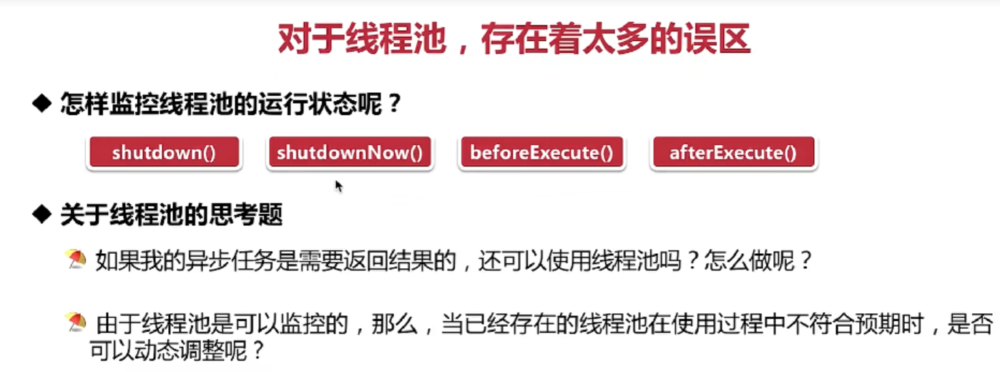

# ThreadLocal

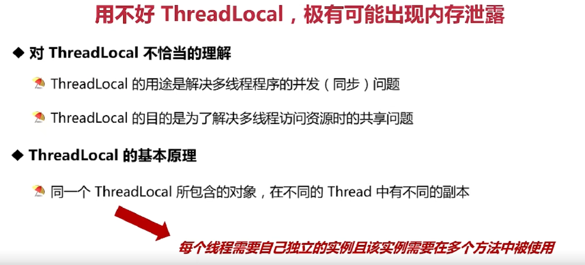

    